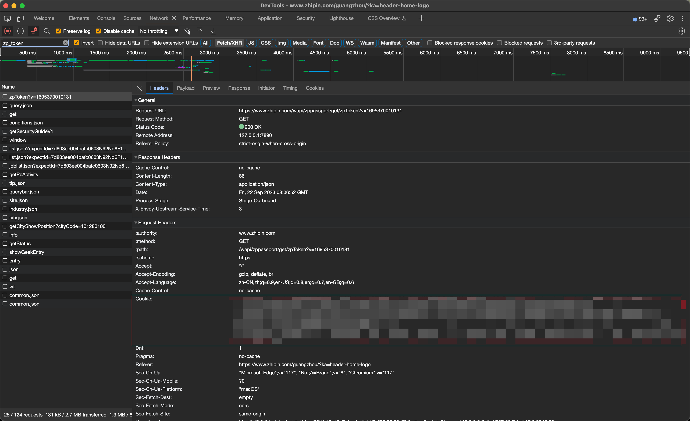
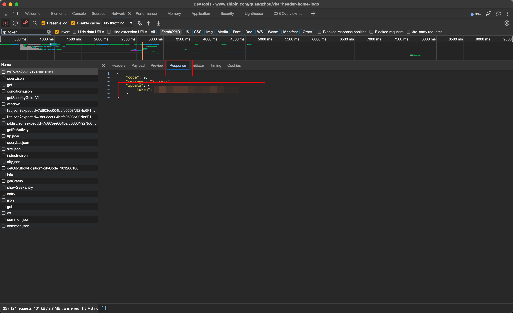

# Tools
小工具集合
## Boss直聘企业屏蔽器

### 说明
1. 打开 https://www.zhipin.com/?ka=header-home-logo 登录
2. 打开开发者工具进行抓包：
    - 过滤筛选出 zp_token 的请求
    - 取出 
        - cookie
        - zp_data的 token
    
    

3. 将cookie和zp_data的token 覆盖 `get_cookie` 和`get_zp_token`函数的返回值
4. 运行

-----
